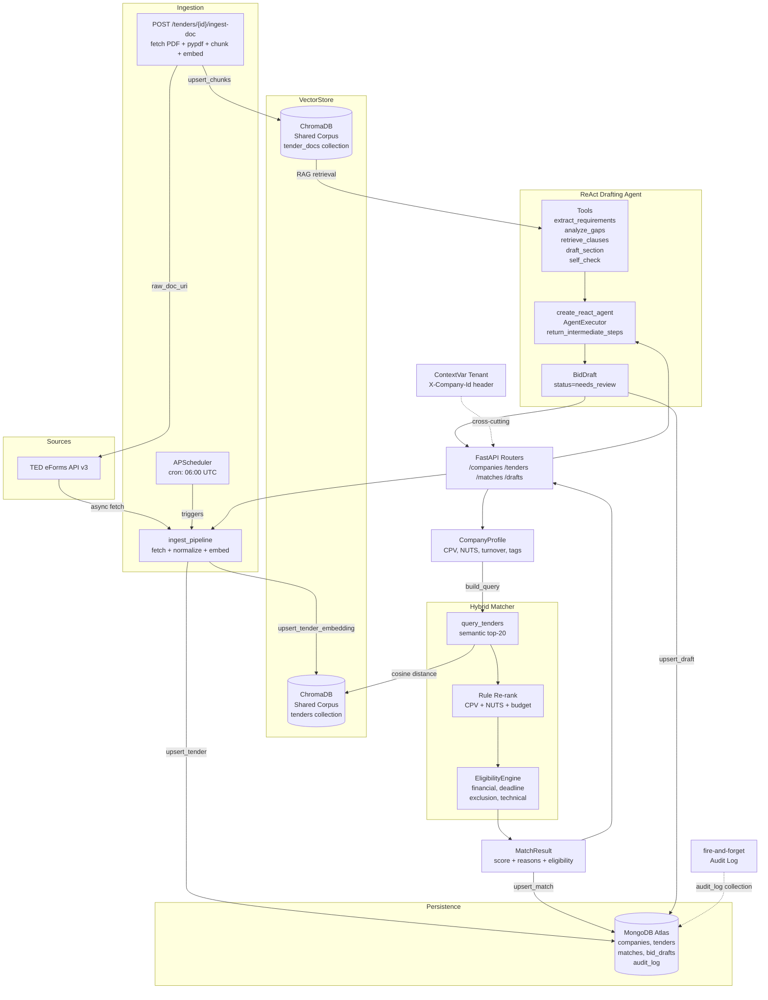

<div align="center">


<br/>

<strong>AI-Native Tender Intelligence for Suppliers</strong>

<em>Semantic matching, eligibility screening and cited bid drafting over public tenders</em>

<br/><br/>


</div>

---

<div align="center">

[](https://github.com/GiorgosPanagopoulos/bidpilot/actions/workflows/ci.yml)
[](https://python.org)
[](https://fastapi.tiangolo.com)
[](https://python.langchain.com)
[](https://trychroma.com)
[](https://mongodb.com/atlas)
[](https://pre-commit.com)
[](LICENSE)

</div>

---

## Overview

BidPilot is a supplier-side tender intelligence backend. It ingests public tenders from TED (Tenders Electronic Daily), matches them to a company profile via a two-stage hybrid engine (semantic retrieval followed by explainable rule re-ranking), screens each match through a declarative eligibility engine, and -- in Phase 3 -- runs a ReAct agent that reads the tender document (PDF), extracts structured requirements, analyses capability gaps, and drafts a cited technical proposal section by section. All draft output is marked `needs_review`: the API enforces a mandatory human-review gate and provides no auto-submit path.

Built on the same production architecture as ProcureAI: ContextVar multi-tenancy via the `X-Company-Id` header, custom exceptions with a global FastAPI handler, fire-and-forget Mongo audit logging, file-based versioned prompts with hot-reload via the `PromptLoader` singleton, and full CI (ruff, mypy, pytest).

---

## Features

| Feature | Description |
|---------|-------------|
| Tender Ingestion | Fetches and normalises TED eForms API v3 notices into a canonical `Tender` model with CPV codes, NUTS regions, budget, and deadline |
| TED Connector | Async `TEDSource` with configurable base URL, date-range fetch, and typed normalisation with graceful fallbacks |
| Shared Vector Corpus | ChromaDB persistent store holds all ingested tenders; every company profile queries against the single shared corpus |
| Hybrid Matcher | Two-stage pipeline: semantic cosine-distance retrieval (top-k) followed by rule re-ranking on CPV ratio, NUTS match, and budget feasibility |
| Explainable Reasons | Every `MatchResult` carries a `reasons[]` list so no match is silently promoted or dropped |
| Declarative Eligibility Engine | YAML-driven `EligibilityEngine` enforces financial capacity (hard), minimum lead days (hard), exclusion flag overlap (hard), and technical coverage (soft warning) |
| Hot-Reload Rules | `EligibilityEngine.reload()` re-reads `config/eligibility_rules.yaml` at runtime without a server restart |
| RAG Bid Drafting | ReAct agent (LangChain `create_react_agent` + `AgentExecutor`) reads an ingested tender PDF, extracts a structured `RequirementChecklist`, runs a `GapReport`, then drafts cited `BidDraftSection` objects via five specialised tools |
| Requirement Extraction | LLM-powered structured extraction of technical, financial, legal, administrative, and submission requirements, each with a `ProposalCitation` (locator + snippet) |
| Gap Analysis | Pure-logic matching of `RequirementChecklist` against `CompanyProfile` (capacity tags, turnover, exclusion flags); produces `GapReport` with `met/partial/unmet` per item and an overall `coverage_ratio` |
| Cited Proposal Sections | `draft_section` tool retrieves tender clauses and grounded company capabilities, then drafts prose with inline `[Locator]` citations; fabricated requirements are not permitted |
| Self-Check | `self_check` tool validates each drafted section against mandatory requirements and reports missing coverage |
| Human-in-the-Loop | `BidDraft.status` is always `needs_review`; the API response includes a mandatory-review notice; no auto-submit path exists |
| File-Based Versioned Prompts | `PromptLoader` singleton reads `prompts/{name}/{version}.txt` fresh on every call (hot-reloadable); used for all LLM instructions |
| Token and Cost Tracking | `TokenCostCallback` accumulates input/output tokens per agent run; `TokenUsage.cost_usd` computes cost from a per-model rate table |
| Multi-Tenancy | `X-Company-Id` header propagated to a Python `ContextVar`; all Mongo writes and audit events carry tenant identity |
| Fire-and-Forget Audit Log | Non-blocking `asyncio.ensure_future` writes every company, tender, match, and draft event to `audit_log` |
| Custom Exception Layer | Typed hierarchy with a single global FastAPI handler |
| APScheduler Cron | Daily auto-ingestion at 06:00 UTC (configurable via `INGEST_CRON`), also triggerable on-demand |
| CI Pipeline | GitHub Actions: ruff lint, mypy type-check, pytest (29 tests), gated on pushes and PRs to `main` |

---

## Architecture



---

## Tech Stack

| Badge | Component | Role |
|-------|-----------|------|
|  | **Python 3.12** | Runtime, async/await throughout |
|  | **FastAPI 0.111** | REST API, dependency injection, lifespan hooks, global exception handler |
|  | **LangChain + langchain-anthropic** | ReAct agent (`create_react_agent`), tool definitions, chat model interface |
|  | **Anthropic Claude** | LLM for requirement extraction, section drafting, and self-check (model configurable via `AGENT_MODEL`) |
|  | **ChromaDB 0.5** | Persistent local vector store: `tenders` corpus for matching, `tender_docs` corpus for RAG drafting |
|  | **MongoDB Atlas + Motor 3** | Async document persistence: companies, tenders, matches, bid_drafts, audit log |
|  | **APScheduler 3.10** | AsyncIOScheduler driving the cron-based tender ingestion pipeline |
|  | **Pydantic v2** | Data validation and typed settings via pydantic-settings |
| pypdf | **pypdf 4** | PDF text extraction for tender document ingestion |

---

## Quick Start

```bash
# 1. Clone
git clone https://github.com/GiorgosPanagopoulos/bidpilot.git
cd bidpilot

# 2. Create virtual environment (Python 3.12 required)
python3.12 -m venv .venv
source .venv/bin/activate

# 3. Install with dev extras
pip install -e ".[dev]"

# 4. Configure environment
cp .env.example .env
# Edit .env: set ANTHROPIC_API_KEY and MONGODB_URI at minimum

# 5. Run
uvicorn app.main:app --reload

# Interactive API docs: http://localhost:8000/docs
# Health check:        http://localhost:8000/health
```

---

## Environment Variables

| Variable | Description | Required | Default |
|----------|-------------|:--------:|---------|
| `ANTHROPIC_API_KEY` | Anthropic API key for Claude LLM | **Yes** | |
| `MONGODB_URI` | MongoDB Atlas connection string | **Yes** | |
| `MONGO_DB_NAME` | MongoDB database name | No | `bidpilot` |
| `CHROMA_PATH` | File system path for ChromaDB persistence | No | `./chroma_data` |
| `TED_API_BASE` | TED eForms API v3 base URL | No | `https://api.ted.europa.eu/v3` |
| `WEIGHT_SEMANTIC` | Semantic score weight in final match score | No | `0.6` |
| `WEIGHT_RULE` | Rule re-rank score weight in final match score | No | `0.4` |
| `MATCH_TOP_K` | Number of semantic candidates retrieved before rule re-ranking | No | `20` |
| `BUDGET_FEASIBILITY_FACTOR` | Multiplier on annual turnover for budget feasibility check | No | `2.0` |
| `INGEST_CRON` | Cron expression for scheduled automatic ingestion | No | `0 6 * * *` |
| `AGENT_MODEL` | Anthropic model for the drafting agent | No | `claude-sonnet-4-5` |
| `LOG_LEVEL` | Logging verbosity | No | `INFO` |

> Eligibility rule thresholds live in `config/eligibility_rules.yaml` and are reloaded at runtime via `EligibilityEngine.reload()`. Agent prompts live in `prompts/{name}/v1.txt` and are reloaded on every call via `PromptLoader`.

---

## API Endpoints

| Method | Endpoint | Description |
|--------|----------|-------------|
| `POST` | `/companies` | Create or update a company profile |
| `GET` | `/companies/{company_id}` | Retrieve a company profile by ID |
| `POST` | `/tenders/ingest` | Trigger an on-demand TED ingestion run; returns `{"ingested": N}` (HTTP 202) |
| `GET` | `/tenders` | List persisted tenders, filterable by `status` and `cpv` |
| `POST` | `/tenders/{id}/ingest-doc` | Fetch the tender PDF from `raw_doc_uri`, extract text (pypdf), chunk, and embed into the `tender_docs` corpus (HTTP 202) |
| `POST` | `/matches/run` | Run the full hybrid matching pipeline for `company_id` |
| `GET` | `/matches` | Retrieve stored match results for `company_id`, sorted by score descending |
| `POST` | `/drafts/run` | Body `{company_id, tender_id}`: run the ReAct drafting agent and return a `BidDraft` (status `needs_review`, HTTP 201) |
| `GET` | `/drafts/{id}` | Retrieve a stored `BidDraft` by ID (tenant-scoped) |
| `GET` | `/drafts/{id}/trace` | Retrieve the ReAct reasoning trace (thought/action/observation steps) |
| `GET` | `/health` | Liveness probe |

All endpoints accept the optional `X-Company-Id` header for multi-tenant context propagation. Draft endpoints enforce that the result requires mandatory human review before any submission.

---

## Project Structure

```
bidpilot/
├── agent/
│   ├── executor.py             # run_drafting_agent: create_react_agent + AgentExecutor, trace builder
│   ├── prompt.py               # PromptLoader singleton (hot-reloadable file-based versioned prompts)
│   └── tools.py                # Five @tool functions: extract_requirements, analyze_gaps,
│                               #   retrieve_clauses, draft_section, self_check
├── llm/
│   ├── callbacks.py            # TokenCostCallback: accumulates input/output tokens per run
│   ├── clients.py              # get_drafting_llm(): ChatAnthropic factory (model from settings)
│   └── pricing.py              # TokenUsage dataclass with cost_usd computed from per-model rates
├── prompts/
│   ├── system/v1.txt           # ReAct system prompt (workflow instructions + tool format)
│   ├── requirement_extraction/v1.txt
│   ├── draft_section/v1.txt
│   └── self_check/v1.txt
├── app/
│   ├── main.py                 # FastAPI app factory, lifespan, router registration
│   ├── api/
│   │   ├── deps.py             # set_tenant dependency
│   │   └── routers/
│   │       ├── companies.py
│   │       ├── drafts.py       # POST /drafts/run, GET /drafts/{id}, GET /drafts/{id}/trace
│   │       ├── matches.py
│   │       └── tenders.py      # POST /tenders/ingest, GET /tenders, POST /tenders/{id}/ingest-doc
│   ├── core/
│   │   ├── context.py
│   │   ├── exceptions.py       # + DocumentParsingError, RequirementExtractionError, DraftingError
│   │   ├── logging.py
│   │   └── settings.py         # + agent_model (AGENT_MODEL env var)
│   ├── ingestion/
│   │   ├── base.py
│   │   ├── doc_parser.py       # parse_pdf_to_chunks: pypdf extraction + paragraph chunking
│   │   ├── ted.py
│   │   └── scheduler.py
│   ├── matching/
│   │   ├── eligibility.py
│   │   └── matcher.py
│   ├── models/
│   │   ├── company.py
│   │   ├── draft.py            # ProposalCitation, RequirementItem, RequirementChecklist,
│   │   │                       #   GapItem, GapReport, BidDraftSection, BidDraft
│   │   ├── match.py
│   │   └── tender.py
│   ├── repositories/
│   │   ├── audit.py
│   │   ├── companies.py
│   │   ├── drafts.py           # upsert_draft, get_draft, save_trace, get_trace
│   │   ├── matches.py
│   │   ├── mongo.py
│   │   └── tenders.py          # + get_tender
│   └── vectorstore/
│       ├── chroma.py           # tenders corpus
│       └── tender_docs.py      # tender_docs corpus: upsert_chunks, query_tender_docs,
│                               #   get_all_tender_chunks, has_tender_docs
├── config/
│   └── eligibility_rules.yaml
├── tests/
│   ├── conftest.py
│   ├── test_doc_ingest.py
│   ├── test_draft_pipeline.py
│   ├── test_eligibility.py
│   ├── test_gap_analysis.py
│   ├── test_matcher.py
│   ├── test_requirement_extraction.py
│   ├── test_self_check.py
│   └── test_ted_normalize.py
├── .env.example
├── .github/workflows/ci.yml
├── .pre-commit-config.yaml
└── pyproject.toml
```

---

## Roadmap

- Phase 1 - Ingestion + Hybrid Match MVP (Complete)
- Phase 2 - Eligibility Engine + CI (Complete)
- Phase 3 - RAG Bid Drafting (ReAct agent, requirement extraction, gap analysis, cited drafts) (Complete)
- Phase 4 - Award Analytics (ΔΙΑΥΓΕΙΑ/ΚΗΜΔΗΣ award data, historical pricing, win rates, dashboard)
- Frontend - React 19 / TS / Vite / Tailwind v4 (Tender Feed + Bid Workspace)

---

## License

MIT. See [LICENSE](LICENSE).

---

<div align="center">
<strong>Built by <a href="https://github.com/GiorgosPanagopoulos">Georgios Panagopoulos</a></strong><br/>
<em>"I build things I'd trust with something that matters."</em>
<br/><br/>
<a href="https://github.com/GiorgosPanagopoulos"></a>
<a href="https://linkedin.com/in/georgios-panagopoulos-9253842ba"></a>
<br/><br/>
Powered by mass amounts of caffeine and mass amounts of curiosity
</div>
