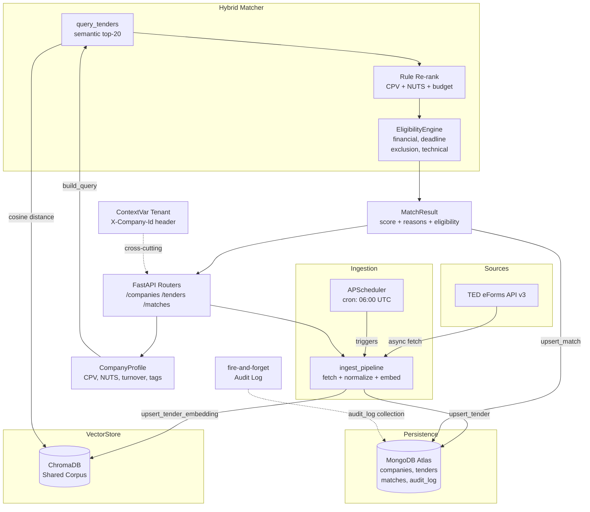

<div align="center">

<h1>🎯 BidPilot</h1>

<strong>AI-Native Tender Intelligence for Suppliers</strong>

<em>Semantic matching, eligibility screening and bid intelligence over public tenders</em>

<br/><br/>


</div>

---

<div align="center">

[](https://github.com/GiorgosPanagopoulos/bidpilot/actions/workflows/ci.yml)
[](https://python.org)
[](https://fastapi.tiangolo.com)
[](https://python.langchain.com)
[](https://trychroma.com)
[](https://mongodb.com/atlas)
[](https://pre-commit.com)
[](LICENSE)

</div>

---

## Overview

BidPilot is a supplier-side tender intelligence backend. It ingests public tenders from TED (Tenders Electronic Daily), with ΚΗΜΔΗΣ and ΕΣΗΔΗΣ as planned sources, matches them to a company profile via a two-stage hybrid engine (semantic retrieval followed by explainable rule re-ranking), and screens each match through a declarative eligibility engine covering financial capacity, minimum lead days, exclusion flag overlap, and technical coverage. Built on the same production architecture as ProcureAI: ContextVar multi-tenancy via the `X-Company-Id` header, custom exceptions with a global FastAPI handler, fire-and-forget Mongo audit logging, file-based rules config with hot-reload, and full CI (ruff, mypy, pytest). The test suite covers **24 tests** across ingestion normalisation, hybrid scoring, and eligibility screening.

---

## ✨ Features

| Feature | Description |
|---------|-------------|
| 📥 **Tender Ingestion** | Fetches and normalises TED eForms API v3 notices into a canonical `Tender` model with CPV codes, NUTS regions, budget, and deadline |
| 🔌 **TED Connector** | Async `TEDSource` with configurable base URL, date-range fetch, and typed normalisation with graceful fallbacks for missing fields |
| 🗂️ **Shared Vector Corpus** | ChromaDB persistent store holds all ingested tenders; every company profile queries against the single shared corpus |
| 🔍 **Hybrid Matcher** | Two-stage pipeline: semantic cosine-distance retrieval (top-k) followed by rule re-ranking on CPV ratio, NUTS match, and budget feasibility |
| 💡 **Explainable Reasons** | Every `MatchResult` carries a `reasons[]` list so no match is silently promoted or dropped without a human-readable justification |
| ⚖️ **Declarative Eligibility Engine** | YAML-driven `EligibilityEngine` enforces financial capacity (hard), minimum lead days (hard), exclusion flag overlap (hard), and technical coverage (soft warning) |
| 🔄 **Hot-Reload Rules** | `EligibilityEngine.reload()` re-reads `config/eligibility_rules.yaml` at runtime; compliance updates take effect without a server restart |
| 🏢 **Multi-Tenancy** | `X-Company-Id` header propagated to a Python `ContextVar`; all Mongo writes and audit events carry the tenant identity |
| 📝 **Fire-and-Forget Audit Log** | Non-blocking `asyncio.ensure_future` writes every company, tender, and match event to a dedicated `audit_log` collection in MongoDB |
| 🚨 **Custom Exception Layer** | Typed hierarchy (`BidPilotError`, `NotFoundError`, `TenderIngestionError`, `SourceUnavailableError`, `MatchingError`) with a single global FastAPI handler |
| ⏰ **APScheduler Cron** | Daily auto-ingestion at 06:00 UTC (configurable via `INGEST_CRON`), also triggerable on-demand via `POST /tenders/ingest` |
| ✅ **CI Pipeline** | GitHub Actions: ruff lint, mypy type-check, pytest (24 tests), gated on pushes and PRs to `main` |

---

## 💬 Example

`POST /matches/run?company_id=comp-001` for an Attica-based civil engineering firm (CPV: `45000000`, `72000000`; NUTS: `EL30`; annual turnover: EUR 5,000,000):

```json
[
  {
    "tender_id": "ted-12345678",
    "company_id": "comp-001",
    "score": 0.847,
    "semantic_score": 0.91,
    "rule_score": 0.75,
    "reasons": [
      "CPV overlap 2 code(s) (100%)",
      "NUTS region match",
      "budget within capacity"
    ],
    "eligibility": {
      "passed": true,
      "failed_criteria": [],
      "warnings": [],
      "rule_version": "1.0.0"
    }
  },
  {
    "tender_id": "ted-87654321",
    "company_id": "comp-001",
    "score": 0.421,
    "semantic_score": 0.64,
    "rule_score": 0.30,
    "reasons": [
      "CPV overlap 1 code(s) (50%)",
      "budget within capacity"
    ],
    "eligibility": {
      "passed": false,
      "failed_criteria": [
        "annual turnover 500000 below required 3200000"
      ],
      "warnings": [
        "no NUTS region overlap",
        "technical coverage 33% below 50% threshold"
      ],
      "rule_version": "1.0.0"
    }
  }
]
```

The first tender (CPV: `45000000-7, 45233000-9`, NUTS: `EL30`, budget: EUR 3,500,000) passes all eligibility criteria and ranks at the top. The second (NUTS: `EL61`, budget: EUR 3,200,000) fails the financial capacity check and is sorted to the bottom of the result list, with warnings retained for transparency.

---

## 🏗️ Architecture



---

## 🛠️ Tech Stack

| Badge | Component | Role |
|-------|-----------|------|
|  | **Python 3.12** | Runtime, async/await throughout |
|  | **FastAPI 0.111** | REST API, dependency injection, lifespan hooks, global exception handler |
|  | **LangChain + langchain-anthropic** | Embedding pipeline; sentence-transformers in Phase 1, Voyage-3 planned for Phase 3 |
|  | **Anthropic Claude** | LLM layer wired up for Phase 3 RAG bid drafting |
|  | **ChromaDB 0.5** | Persistent local vector store for the shared tender corpus |
|  | **MongoDB Atlas + Motor 3** | Async document persistence: companies, tenders, matches, audit log |
|  | **APScheduler 3.10** | AsyncIOScheduler driving the cron-based tender ingestion pipeline |
|  | **Pydantic v2** | Data validation and typed settings via pydantic-settings |

---

## 🚀 Quick Start

```bash
# 1. Clone
git clone https://github.com/GiorgosPanagopoulos/bidpilot.git
cd bidpilot

# 2. Create virtual environment (Python 3.12 required)
python3.12 -m venv .venv
source .venv/bin/activate

# 3. Install with dev extras
pip install -e ".[dev]"

# 4. Configure environment
cp .env.example .env
# Edit .env: set ANTHROPIC_API_KEY and MONGODB_URI at minimum

# 5. Run
uvicorn app.main:app --reload

# Interactive API docs: http://localhost:8000/docs
# Health check:        http://localhost:8000/health
```

---

## 🔑 Environment Variables

| Variable | Description | Required | Default |
|----------|-------------|:--------:|---------|
| `ANTHROPIC_API_KEY` | Anthropic API key for Claude LLM and embeddings | **Yes** | |
| `MONGODB_URI` | MongoDB Atlas connection string | **Yes** | |
| `MONGO_DB_NAME` | MongoDB database name | No | `bidpilot` |
| `CHROMA_PATH` | File system path for ChromaDB persistence | No | `./chroma_data` |
| `TED_API_BASE` | TED eForms API v3 base URL | No | `https://api.ted.europa.eu/v3` |
| `WEIGHT_SEMANTIC` | Semantic score weight in final match score (must sum to 1.0 with `WEIGHT_RULE`) | No | `0.6` |
| `WEIGHT_RULE` | Rule re-rank score weight in final match score | No | `0.4` |
| `MATCH_TOP_K` | Number of semantic candidates retrieved before rule re-ranking | No | `20` |
| `BUDGET_FEASIBILITY_FACTOR` | Multiplier on annual turnover for budget feasibility check | No | `2.0` |
| `INGEST_CRON` | Cron expression for scheduled automatic ingestion | No | `0 6 * * *` |
| `LOG_LEVEL` | Logging verbosity: `DEBUG`, `INFO`, `WARNING`, `ERROR` | No | `INFO` |

> Eligibility rule thresholds (turnover ratio, minimum lead days, technical coverage threshold) live in `config/eligibility_rules.yaml` and are reloaded at runtime via `EligibilityEngine.reload()` without a server restart.

---

## 📡 API Endpoints

| Method | Endpoint | Description |
|--------|----------|-------------|
| `POST` | `/companies` | Create or update a company profile (CPV codes, NUTS regions, turnover, capacity tags) |
| `GET` | `/companies/{company_id}` | Retrieve a company profile by ID |
| `POST` | `/tenders/ingest` | Trigger an on-demand TED ingestion run; returns `{"ingested": N}` (HTTP 202) |
| `GET` | `/tenders` | List persisted tenders, filterable by `status` and `cpv` query parameters |
| `POST` | `/matches/run` | Run the full hybrid matching pipeline for `company_id`; persists and returns ranked `MatchResult` list |
| `GET` | `/matches` | Retrieve stored match results for `company_id`, sorted by score descending |
| `GET` | `/health` | Liveness probe |

All endpoints accept the optional `X-Company-Id` header for multi-tenant context propagation.

---

## 📁 Project Structure

```
bidpilot/
├── app/
│   ├── main.py                     # FastAPI app factory, lifespan, router registration
│   ├── api/
│   │   ├── deps.py                 # set_tenant dependency: X-Company-Id header to ContextVar
│   │   └── routers/
│   │       ├── companies.py        # POST /companies, GET /companies/{id}
│   │       ├── tenders.py          # POST /tenders/ingest, GET /tenders
│   │       └── matches.py          # POST /matches/run, GET /matches
│   ├── core/
│   │   ├── context.py              # ContextVar[current_tenant]
│   │   ├── exceptions.py           # BidPilotError hierarchy + global FastAPI handler
│   │   ├── logging.py              # basicConfig structured logging setup
│   │   └── settings.py             # pydantic-settings Settings (reads .env)
│   ├── ingestion/
│   │   ├── base.py                 # TenderSource Protocol (fetch + normalize)
│   │   ├── ted.py                  # TED eForms API v3 async connector and normaliser
│   │   └── scheduler.py            # APScheduler cron pipeline (ingest_pipeline)
│   ├── matching/
│   │   ├── eligibility.py          # EligibilityEngine: YAML rules, hot-reload, check()
│   │   └── matcher.py              # run_matching: semantic retrieval + rule re-rank
│   ├── models/
│   │   ├── company.py              # CompanyProfile (CPV, NUTS, turnover, capacity_tags)
│   │   ├── tender.py               # Tender, RawTender, TenderSource and TenderStatus enums
│   │   └── match.py                # MatchResult, EligibilityCheck
│   ├── repositories/
│   │   ├── audit.py                # fire_and_forget: non-blocking audit log writer
│   │   ├── companies.py            # upsert_company, get_company
│   │   ├── matches.py              # upsert_match, list_matches
│   │   ├── mongo.py                # Motor async client + get_db()
│   │   └── tenders.py              # upsert_tender, list_tenders
│   └── vectorstore/
│       └── chroma.py               # ChromaDB persistent client, upsert_tender_embedding, query_tenders
├── config/
│   └── eligibility_rules.yaml      # Declarative eligibility rule thresholds (hot-reload)
├── tests/
│   ├── conftest.py                 # Shared fixtures: company profile, tender meta dicts, TED payload
│   ├── test_eligibility.py         # 7 tests: hard criteria, soft warnings, hot-reload, rule versioning
│   ├── test_matcher.py             # 13 tests: CPV overlap, NUTS match, budget feasibility, rule score
│   └── test_ted_normalize.py       # 4 tests: TED notice normalisation edge cases
├── .env.example                    # Environment variable template
├── .github/workflows/ci.yml        # GitHub Actions: lint + mypy + pytest (gated on main)
├── .pre-commit-config.yaml         # ruff, mypy, detect-secrets pre-commit hooks
└── pyproject.toml                  # Project metadata, dependencies, ruff/mypy/pytest config
```

---

## 💡 Why BidPilot?

| Decision | Rationale |
|----------|-----------|
| 🏢 **Supplier-side, not buyer-side** | Buyers have institutional procurement platforms. Suppliers, especially SMEs, have no dedicated tooling to discover and qualify for relevant tenders at scale. BidPilot is built exclusively for the supplier perspective. |
| 🔍 **Hybrid match over pure vector** | Pure semantic search misses structural hard constraints (CPV codes, NUTS region, budget range). Pure keyword matching misses semantic similarity across languages and synonyms. The two-stage pipeline delivers both recall and precision. |
| 💡 **Explainable reasons, no silent drops** | Every result includes a `reasons[]` list and a `failed_criteria[]` block. A supplier sees exactly why a tender scored high or was disqualified: no black-box filtering and no surprises. |
| 📋 **Declarative hot-reload rules** | Eligibility criteria change regularly as regulations update and company financials evolve. YAML-driven rules that reload at runtime mean compliance changes take effect without a deployment cycle. |
| 🗄️ **Shared public corpus, tenant-scoped profiles** | TED notices are public data, shared across all tenants. ChromaDB holds one corpus for all; MongoDB scopes company profiles, match results, and audit events per tenant via `ContextVar`. |
| 🔥 **Fire-and-forget audit log** | Audit writes must never slow down API responses. `asyncio.ensure_future` dispatches the write without blocking the request path; failures log a warning and do not propagate to the caller. |

---

## 🔭 Roadmap

- ✅ **Phase 1** - Ingestion + Hybrid Match MVP (Complete)
- ✅ **Phase 2** - Eligibility Engine + CI (Complete)
- 🔜 **Phase 3** - RAG Bid Drafting (ReAct agent, requirement extraction, gap checklist, cited drafts)
- 🔜 **Phase 4** - Award Analytics (ΔΙΑΥΓΕΙΑ/ΚΗΜΔΗΣ award data, historical pricing, win rates, dashboard)
- 🔜 **Frontend** - React 19 / TS / Vite / Tailwind v4 (Tender Feed + Bid Workspace)

---

## 📄 License

MIT. See [LICENSE](LICENSE).

---

<div align="center">
<strong>⚡ Built by <a href="https://github.com/GiorgosPanagopoulos">Georgios Panagopoulos</a></strong><br/>
<em>"I build things I'd trust with something that matters."</em>
<br/><br/>
<a href="https://github.com/GiorgosPanagopoulos"></a>
<a href="https://linkedin.com/in/georgios-panagopoulos-9253842ba"></a>
<br/><br/>
☕ Powered by mass amounts of caffeine & mass amounts of curiosity
</div>
