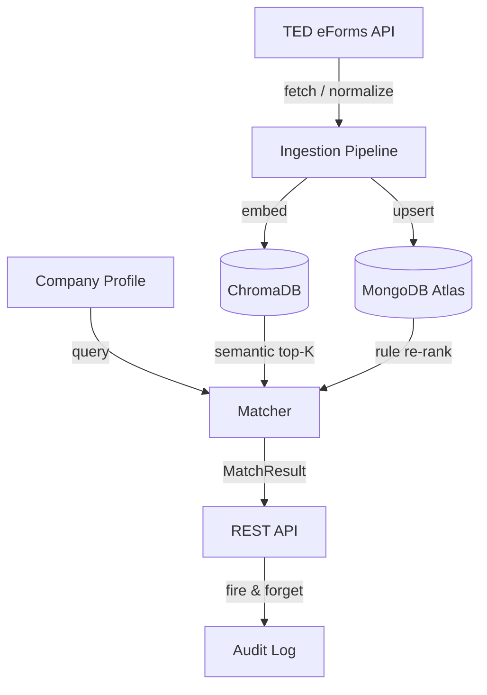

<div align="center">

# BidPilot

**AI-powered tender intelligence for suppliers.**

[](https://github.com/GiorgosPanagopoulos/bidpilot/actions/workflows/ci.yml)


</div>

---

## Architecture



## Layered Structure

```
app/
├── core/          settings, context (ContextVar tenant), exceptions, logging
├── models/        CompanyProfile · Tender · MatchResult · EligibilityCheck
├── repositories/  Mongo CRUD + fire-and-forget audit
├── vectorstore/   ChromaDB shared tender corpus
├── ingestion/     TenderSource protocol · TED connector · APScheduler
├── matching/      Two-stage hybrid matcher (semantic → rule re-rank)
└── api/           FastAPI routers + tenant middleware
```

## Matching Pipeline

**Stage 1 — Semantic:** company profile text → embeddings → ChromaDB top-K.

**Stage 2 — Rule re-rank:**

| Criterion | Type | Weight |
|-----------|------|--------|
| CPV overlap ≥ 1 | Hard | — |
| Deadline in future | Hard | — |
| Status = open | Hard | — |
| CPV overlap ratio | Soft | 0.50 |
| NUTS region match | Soft | 0.30 |
| Budget feasibility | Soft | 0.20 |

`final_score = 0.6 × semantic + 0.4 × rule`

## Quick Start

```bash
cp .env.example .env          # fill in credentials
pip install -e ".[dev]"
pre-commit install
uvicorn app.main:app --reload
```

## API Endpoints

| Method | Path | Description |
|--------|------|-------------|
| POST | `/companies` | Register or update a supplier profile |
| GET | `/companies/{id}` | Retrieve a company profile |
| POST | `/tenders/ingest` | Trigger manual TED ingestion |
| GET | `/tenders` | List tenders (filter by status / CPV) |
| POST | `/matches/run?company_id=` | Compute and persist matches |
| GET | `/matches?company_id=` | Retrieve sorted match feed |
| GET | `/health` | Health check |

## Testing

```bash
pytest -v
```

---

<div align="center">

Built by [Georgios Panagopoulos](https://github.com/GiorgosPanagopoulos)

*"Build tools that make complex things simple."*

</div>
